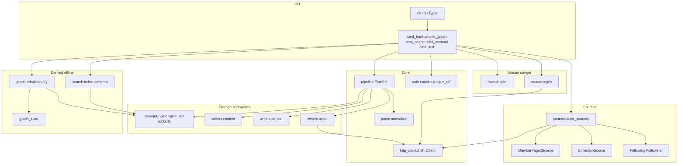
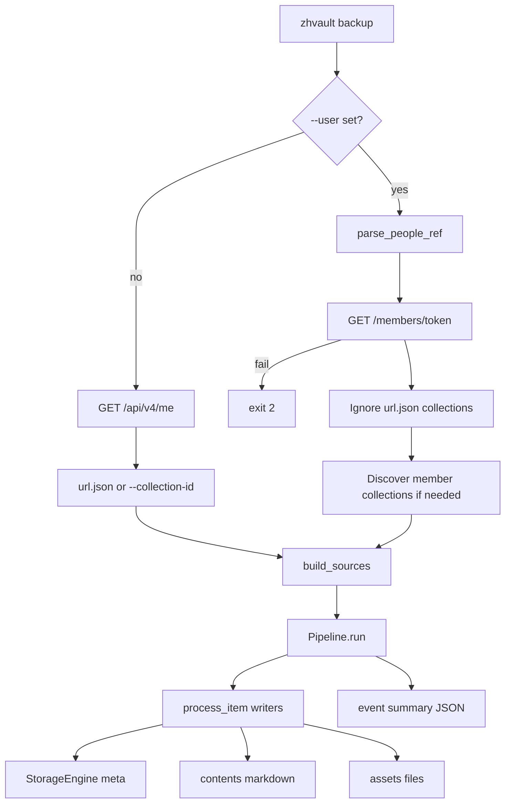
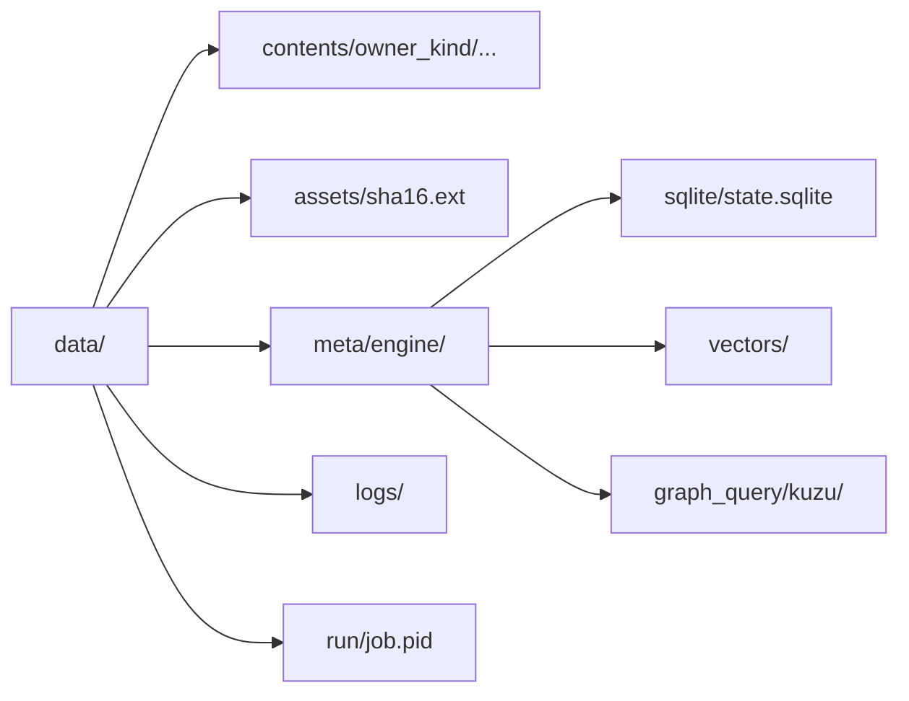
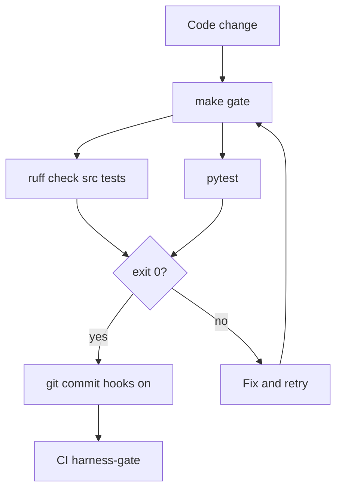

# Project architecture (generated)

<!-- Generated by scripts/gen_architecture_docs.py — do not edit by hand; re-run make docs-arch -->
Generated-at: `2026-08-29T18:31:25Z` (UTC)

Scan root: `src/` (49 import modules).

## Package map

- top-level modules: `auth`, `graph`, `graph_kuzu`, `http_client`, `models`, `parse`, `pipeline`
- `cli/` — `__main__`, `app`, `cmd_account`, `cmd_auth`, `cmd_backup`, `cmd_graph`, `cmd_search`, `common`, `parser`
- `mutate/` — `apply`, `endpoints`, `plan`
- `search/` — `chroma_store`, `chunk`, `embed`, `index`, `memory_store`, `store`, `types`
- `sources/` — `asked_question`, `base`, `collection`, `followed_question`, `followers`, `following`, `member_page`, `pin`, `vote`
- `storage/` — `base`, `json_engine`, `rocks_engine`, `sqlite_engine`
- `writers/` — `asset`, `content`, `person`

## Source classes

- `AskedQuestionSource` (`sources.asked_question`)
- `CollectionSource` (`sources.collection`)
- `FollowedQuestionSource` (`sources.followed_question`)
- `FollowersSource` (`sources.followers`)
- `FollowingSource` (`sources.following`)
- `MemberPagedSource` (`sources.member_page`)
- `PinSource` (`sources.pin`)
- `VoteSource` (`sources.vote`)

## CLI surface

- `zhvault auth set-cookie`
- `zhvault status`
- `zhvault backup`
- `zhvault resume`
- `zhvault graph rebuild|sync|query`
- `zhvault graph edge add|remove`
- `zhvault search index|semantic`
- `zhvault account plan|apply`

## Architecture diagram



## End-to-end backup flow



## Data layout



## Harness green gate



## Related ops docs

- [README.md](./README.md) — ops index
- [flows.md](./flows.md) — confirmed product flowcharts (hand-maintained)
- [runbook.md](./runbook.md) — operator steps

## Regenerate

```bash
make docs-arch
# or: python3 scripts/gen_architecture_docs.py
```
