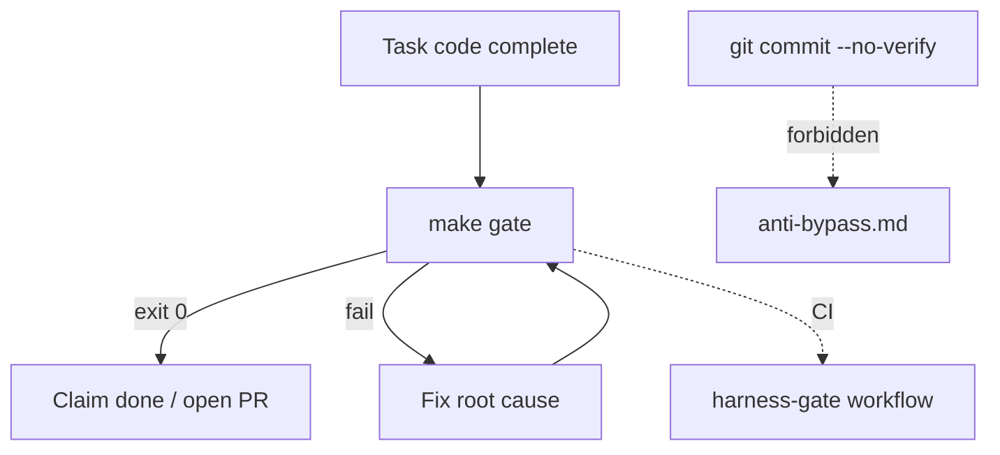
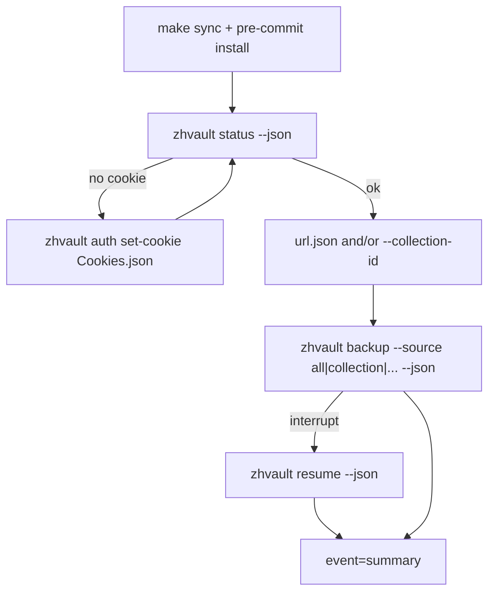
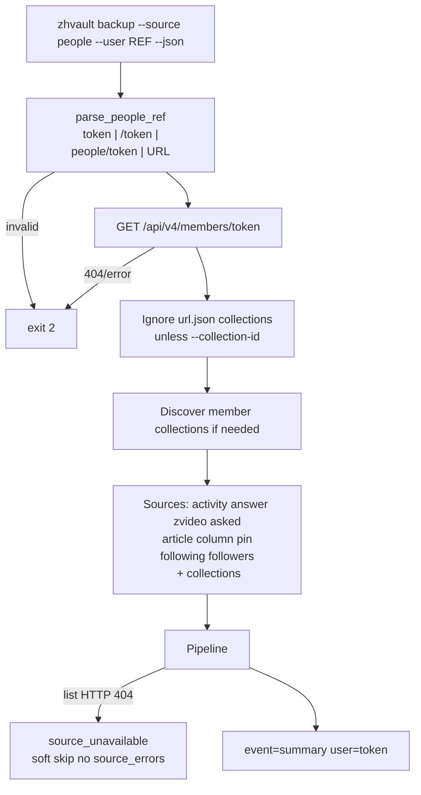
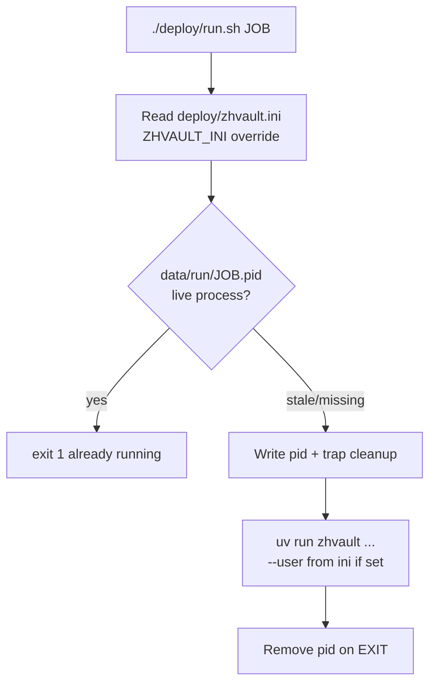
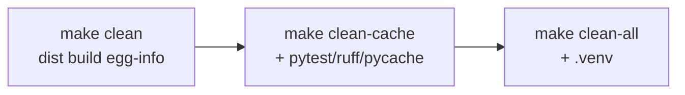

# Confirmed flowcharts

Placeholders only (`<url_token>`); never document real Zhihu handles.

## 1. Green gate (required before claiming done)



## 2. Backup — logged-in self (default)



Notes:

- `--source all` does **not** include following/followers; use `--source social` explicitly.
- Collections come from `url.json` / `--collection-id` when **no** `--user`.

## 3. Backup — other profile (`--user`)



Recommended command:

```bash
zhvault backup --source people --user <url_token> --json
# also OK: --user /<url_token>  or  --user https://www.zhihu.com/people/<url_token>
```

## 4. Deploy runner (ini + pid lock)



## 5. Layered make clean



Never deletes `data/` or `Cookies.json`.
